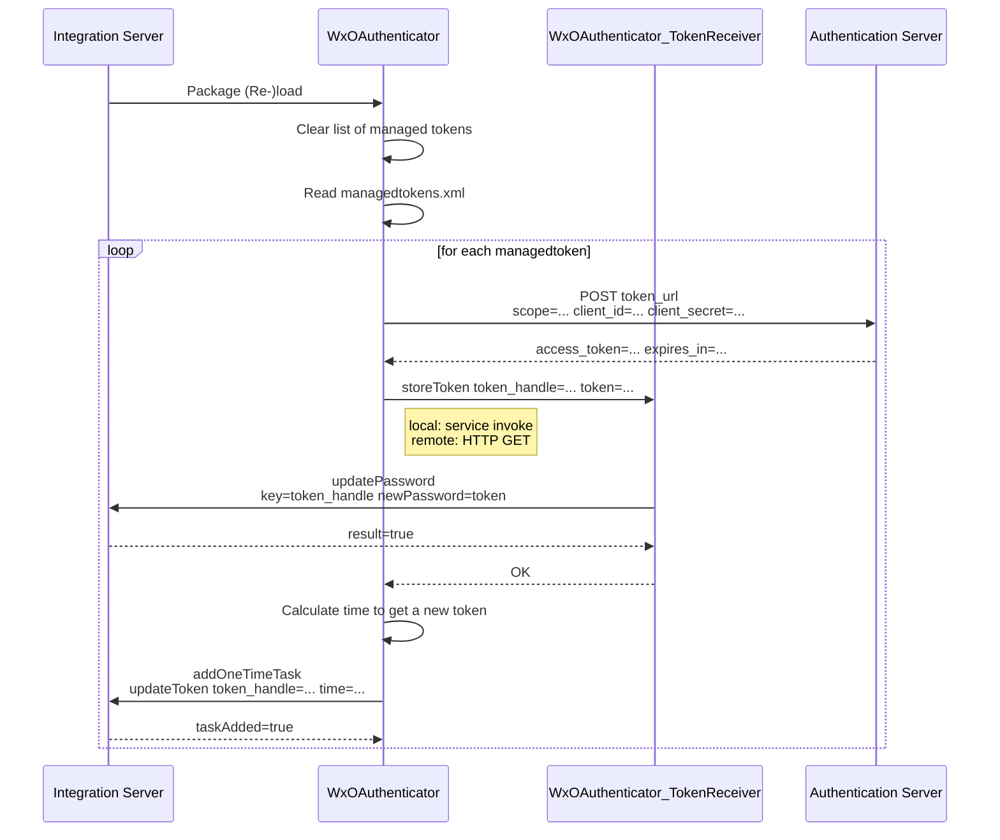
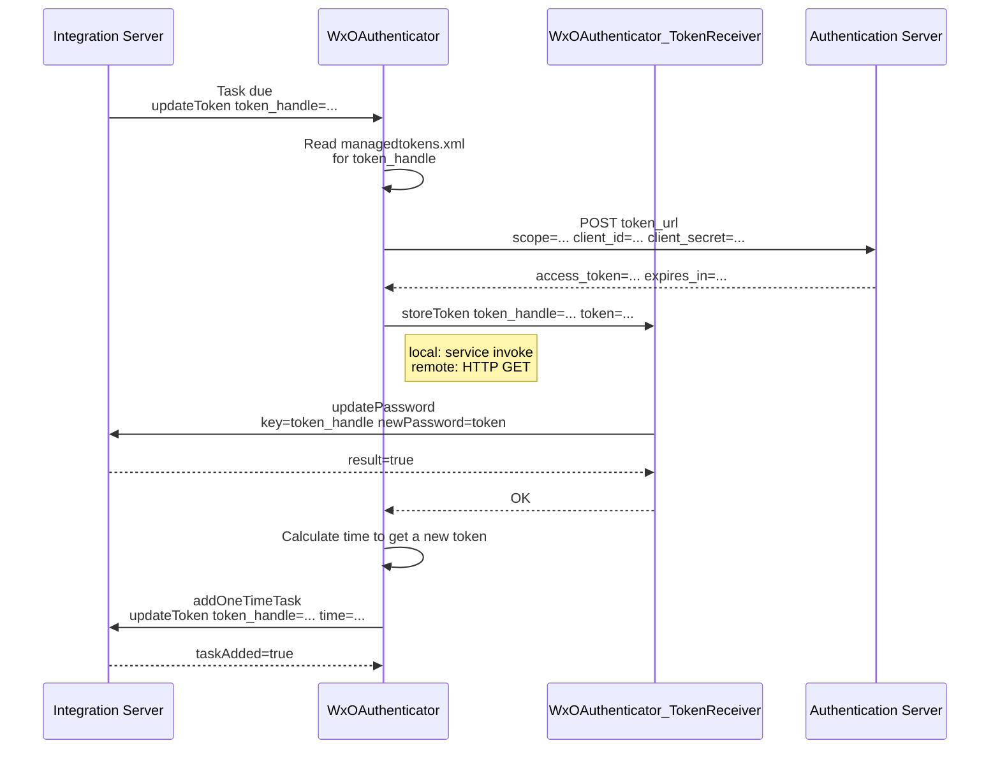
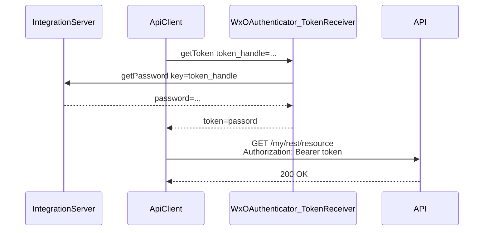

# WxOAuthenticator

A webMethods IntegrationServer module handling OAUth2 Machine-To-Machine (M2M) authentication using the [Client Credentials Flow](https://auth0.com/docs/get-started/authentication-and-authorization-flow/client-credentials-flow).

The main features are:

* Scheduled background jobs for obtaining tokens (and obtaining new tokens in time before the existing one expires)
* Token is stored in the IntegrationServers password database - so secured like any password.
* Scheduled background job can pass the obtained token to another IntegrationServer (via HTTP communication). This allows the client credentials to be stored on a different server than the one using the token.

## Use Cases

* Manage fetching and re-newal of OAuth2 tokens for clients on an an IntegrationServer
* Improve security by keeping client secret isolated from the token

## Tool Information

### Dependencies

This tool uses WxConfig for configuration purposes and WxLog for logging purposes. Both can be obtained via your SoftwareAG Professional Services contact.

### Download and Installation

This tool is still in an early stage of development and no formal releases are available. To install it in your environment, clone this repository, build and install the packages

#### Prerequisiste

WxOAuthenticator needs a user (with limited privileges) to transfer tokens from one IntegrationServer obtaining the token to another using the token. This user is created automatically on each server were WxOAuthenticator_TokenReceiver packages is activated. The sending server needs the same password to be set. 

So on each side, the following encrypted Value needs to be imported. This can be done using the WxConfig Bulk Import feature with the following file as input

~~~
encryptedValue = WxConfig:WxOAuthenticatorCommon:WX_OAUTHENTICATOR_USER_PASSWORD;<thepassword>
~~~
  
Or via the WxConfig API by performing an HTTP PUT on the resource 
~~~  
http://<host>:<port>/rest/wx/config/encrypted?package=WxOAuthenticatorCommon&handle=WX_OAUTHENTICATOR_USER_PASSWORD&value=<thepassword>
~~~

#### MSR Installation

* Clone this repository 
* Copy the packages into the container

#### IntegrationServer installation

* Clone this repository
* Build the packages using ABE
* Deploy into the IntegrationServer

### Configuration

Add the tokens you want WxOAuthenticator to manage to the file config/managetokens.xml

  ~~~
<?xml version="1.0" encoding="UTF-8"?>
<config>
    <!--
        Configuration file containing information how to fetch tokens managed by WxOAuthenticator
    -->
    <managedTokens>
        <managedToken> <!-- repeatable -->
            <token_handle>EchoAPIToken</token_handle> <!-- internal ID used in the code to identify this specific token -->
            <token_url>https://<yourapigateway>/invoke/pub.apigateway.oauth2/getAccessToken</token_url> <!-- url used to retrieve a token. -->
            <token_refresh_grace_time>0.8</token_refresh_grace_time> <!-- Factor used to calculate how long before expiery a new token will be obtained.
                                                                          Example: with a setting of 0.8 and an expiery time of 1800 seconds, a new token will be obtained after
                                                                          1800 * 0.8 = 1440 seconds
                                                                        -->            
            <credentials>
                <grant_type>client_credentials</grant_type> <!-- currently, only client_credentials are supported -->
                <scope>default</scope> <!-- the scope for which the token should be requested. Other settings (like resource and audience) are currently not supported. -->
                <client_id>aef7692c-ebb8-4c52-bd53-0d4caa2f9e0b</client_id> <!-- The client id to request a token for. Recommendation for container use: get it from an environment variable, e.g. ${env:EchoAPIToken_ClientId} -->
                <client_secret>[[encrypted:EchoAPIToken_Secret]]</client_secret> <!-- The client secret. Can be encrpyted (stored in IntegrationServer's password manager [[encrypted:EchoAPIToken_Secret]]) or taken from an environment variable -->
            </credentials>
            <!-- 
            optional, if the token should be updated in another IS via an HTTP call.
            If WxAuthenticator is running in the same IS this can be left out, the token will simply be written to the local outbound passwordstore.
              <update_token>
                  <url>http://localhost:5554/invoke/com.softwareag.wx.oauthenticator_receiver.pub.service:storeToken</url>
                  <auth>
                    <user>WxOAuthenticatorUser</user>
                    <pass>[[encrypted:EchoAPITokenUpdateSecret]]</pass>
                  <auth>
              </update_token>
            -->
        </managedToken>
    </managedTokens>
</config>
~~~

### Usage Scenarios

#### Scenario 1: All managed tokens are obtained by WxOAuthenticator on startup

#### Scenario 2: New tokens are obtained by WxOAuthenticator before expiry

#### Scenario 3: The current token is used by

## Disclaimer

This tool is is not an official Software AG product and as such provided on an as-is basis without any support. 
Feel free to fork this repository and adapt to your own needs. 
